<!-- ===================== HEADER BANNER ===================== -->

  

<!-- ===================== TYPING ANIMATION ===================== -->

  

<!-- ===================== BADGES ROW ===================== -->

  
  

<!-- ===================== ANIMATED DATA BANNER (custom looping SVG, GIF-style) ===================== -->

  

<!-- ===================== ABOUT ME ===================== -->
##  About Me

- 🔭 Currently pursuing my degree at **Informatics Institute of Technology (IIT)**
- 🌱 Deep-diving into **Data Science, Machine Learning & AI**
- 💡 I love turning raw data into meaningful stories and intelligent solutions
- 👯 Open to collaborating on **Data Science & AI projects**
- 💬 Ask me about **Python, Java, and all things data**
- 📫 Reach me at **genuka.20210556@iit.ac.lk**
- ⚡ Fun fact: the best model isn't the most complex one — it's the one that solves a real problem

 

<!-- ===================== TECH STACK ===================== -->
## 🛠️ Tech Stack & Tools

#### Languages

#### Data Science & ML

#### Web & Mobile

#### Databases & Tools

 

<!-- ===================== GITHUB STATS ===================== -->
## 📊 GitHub Stats

  
  

  

 

<!-- ===================== ACTIVITY GRAPH ===================== -->
## 📈 Contribution Graph

  

 

<!-- ===================== TROPHIES ===================== -->
## 🏆 Trophies

  

 

<!-- ===================== CONNECT ===================== -->
## 🤝 Connect With Me

  
  <!-- 👇 Replace the # with your real LinkedIn URL -->
  
  <!-- 👇 Replace the # with your X/Twitter URL -->
  
  <!-- 👇 Replace the # with your portfolio URL (or delete this badge) -->
  

<!-- ===================== SNAKE ANIMATION (optional setup) =====================
To enable the contribution snake below, create a GitHub Action:
1. In this repo, add the file: .github/workflows/snake.yml
2. Use the Platane/snk action (search "Platane/snk" on GitHub for the latest workflow).
3. Once it runs, uncomment the block below.

  

-->

<!-- ===================== FOOTER ===================== -->

  
  
<i>⭐️ Thanks for stopping by — let's build something great with data!</i>

